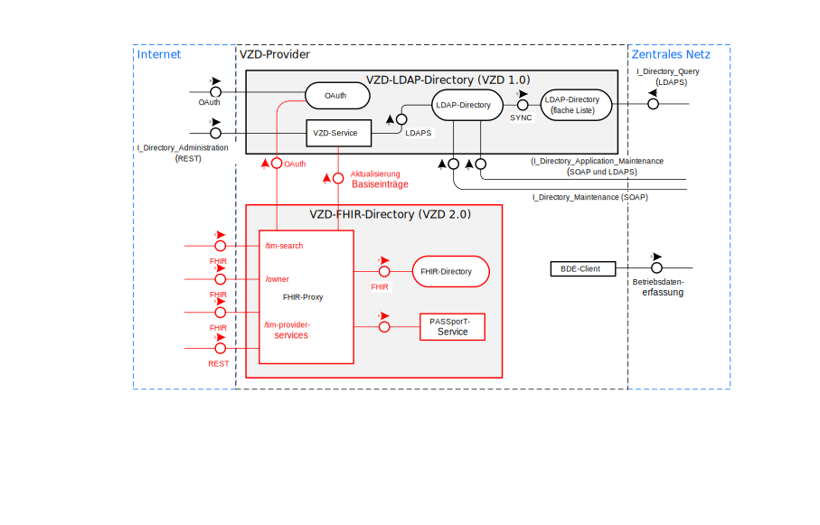

# Verzeichnisdienst - API-Dokumentation

## Allgemeines

Die folgende Dokumentation beschreibt wie der Verzeichnisdienst der Telematikinfrastruktur genutzt werden kann.
Insbesondere welche Daten im FHIR-Directory gespeichert werden und welche Bedeutung sie haben, wird beschrieben.
Die Schnittstellen des Verzeichnisdienstes sind in Spezifikationen der gematik definiert:

- gemSpec_VZD

- gemSpec_FHIR_Directory

Die Daten des LDAP-Directories sind im Implementierungsleitfaden zur Pflege der Daten des Verzeichnisdienstes beschrieben. Die Dokumente können im Fachportal der gematik gefunden werden: https://fachportal.gematik.de/downloadcenter.

## Systemarchitektur

Die folgende Abbildung gibt einen Überblick über die Systemarchitektur des Verzeichnisdienstes.

## FHIR-Directory Datenmodell

## FHIR-Directory Datenbeschreibung

### TIOrganization

### TIPractitioner

### HealthcareService

### PractitionerRole

### Endpoint

## Lizenzbedingungen
Copyright (c) 2020 gematik GmbH

Licensed under the Apache License, Version 2.0 (the "License");
you may not use this file except in compliance with the License.
You may obtain a copy of the License at

http://www.apache.org/licenses/LICENSE-2.0

Unless required by applicable law or agreed to in writing, software
distributed under the License is distributed on an "AS IS" BASIS,
WITHOUT WARRANTIES OR CONDITIONS OF ANY KIND, either express or implied.
See the License for the specific language governing permissions and
limitations under the License. 
